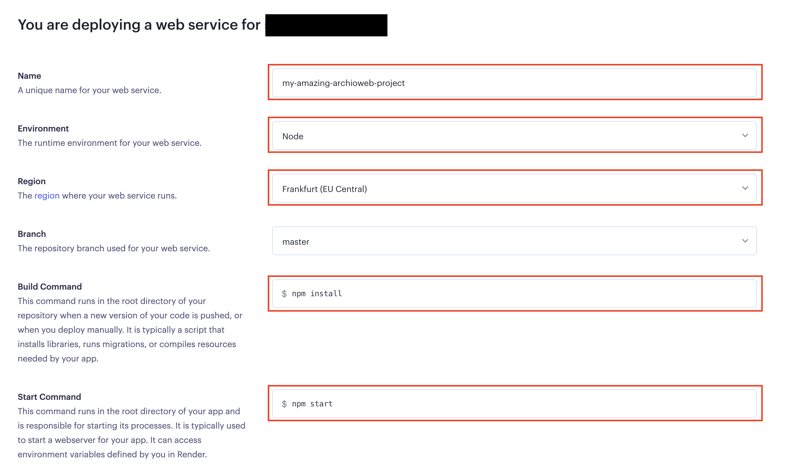
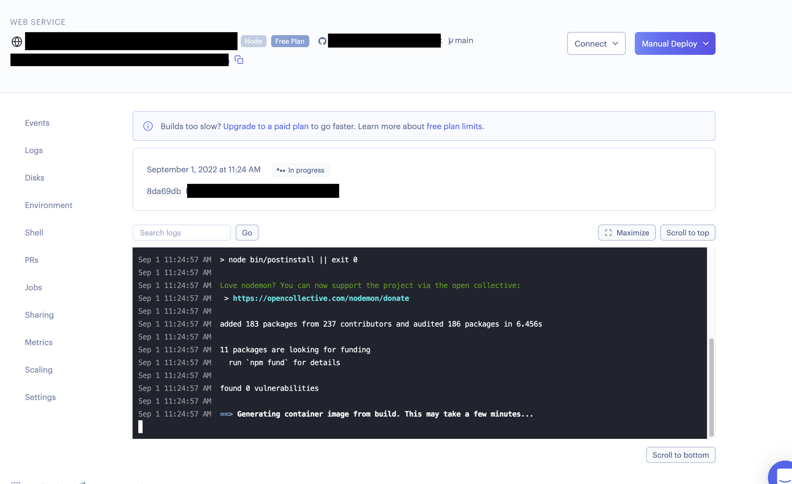
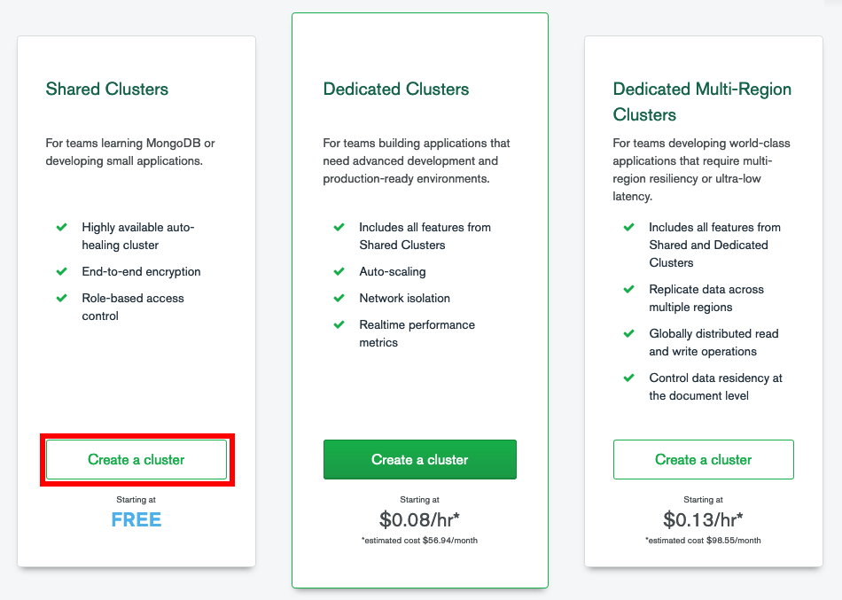
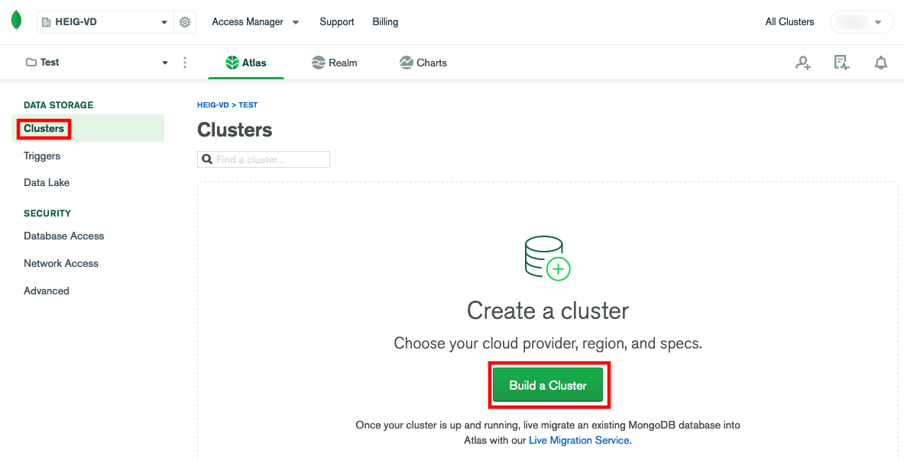
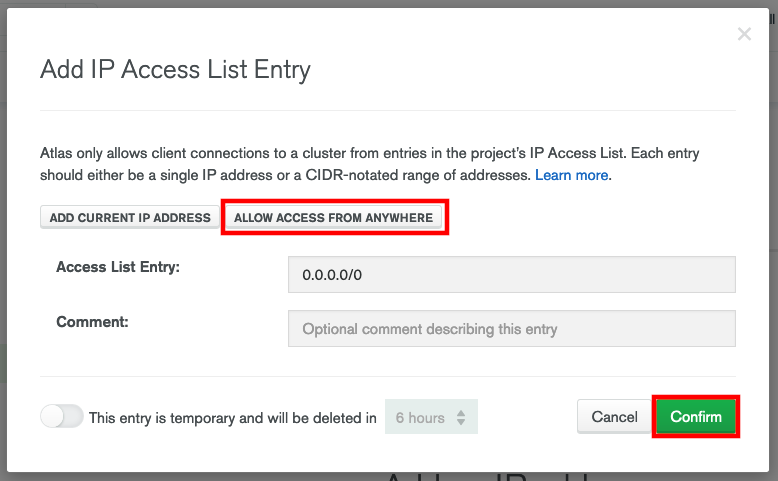
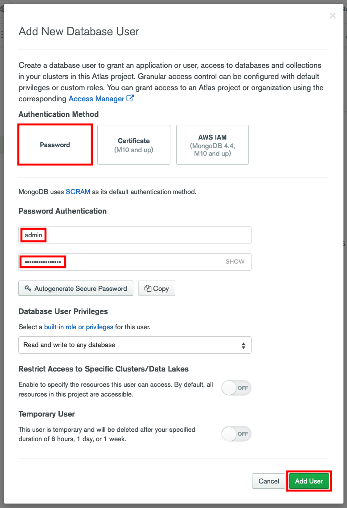

# Deploy an Express.js application with Render & MongoDB Atlas

This guide will walk you through the process of deploying an Express.js
application in the [cloud][cloud]. You will use [Render][render], a
[Platform-as-a-Service][paas] cloud, to run your application; and [MongoDB
Atlas][mongodb-atlas], a database cloud, to host your database.

When working as a team, only one member of the team needs to follow this guide.

<!-- START doctoc generated TOC please keep comment here to allow auto update -->
<!-- DON'T EDIT THIS SECTION, INSTEAD RE-RUN doctoc TO UPDATE -->

- [Requirements](#requirements)
- [Name your project](#name-your-project)
- [Create an Express.js application](#create-an-expressjs-application)
  - [Make it a Git repository](#make-it-a-git-repository)
  - [Push it to GitHub](#push-it-to-github)
- [Connect your application to a database](#connect-your-application-to-a-database)
- [Deploy the application to Render](#deploy-the-application-to-render)
- [Create a MongoDB cluster on MongoDB Atlas](#create-a-mongodb-cluster-on-mongodb-atlas)
- [Provide your database URL to your Render application](#provide-your-database-url-to-your-render-application)

<!-- END doctoc generated TOC please keep comment here to allow auto update -->


## Requirements

* [Node.js][node] 12+
* [Git][git]
* A [GitHub][github] account
* A [Render][render] account
* A [MongoDB Atlas][mongodb-atlas] account


## Name your project

> "There are only [two hard things][two-hard-things] in Computer Science: cache
> invalidation and **naming things**."
>
> -- Phil Karlton

Choose a good name for your project. You will have to use it to name several
things: your Express.js application, the Render application, the MongoDB cluster
and database, etc.


## Create an Express.js application

Install the [Express.js generator][express-generator] if you haven't already:

```bash
$> npm install -g express-generator
```

Generate a new [Express][express] application:

```bash
$> cd /path/to/projects
$> express my-project
```

Make sure it works:

```bash
$> cd my-project
$> npm install
$> npm start
```

Check that you can access it at [http://localhost:3000](http://localhost:3000).
Once you're sure it works, you can stop it with `Ctrl-C`.

### Make it a Git repository

To deploy code on Render, you will need to use [Git][git]. Initialize a Git
repository in the application's directory:

```bash
$> git init
```

Add a `.gitignore` file to ignore the `node_modules` directory (dependencies
will be automatically installed by Render when you push):

```bash
$> echo node_modules > .gitignore
```

The contents of your `.gitignore` file should look like this:

```txt
node_modules
```

Commit all the app's files:

```bash
$> git add --all
$> git commit -m "Initial commit"
```

### Push it to GitHub

Register a [GitHub][github] account if you haven't already.

Create a **private** repository on GitHub, then add it as a remote on your
machine and push your new application to it:

```bash
$> git remote add origin git@github.com:your-github-username/your-repo-name.git
$> git push -u origin master
```

If you have team members, you may add them in the repository's settings on
GitHub so that they also have push access:


## Connect your application to a database

Add [Mongoose][mongoose] to your application:

```bash
$> npm install mongoose
```

Then add the following code to the `app.js` file:

```js
const mongoose = require('mongoose');
mongoose.connect(process.env.DATABASE_URL || 'mongodb://localhost/your-app-name');
```

> Note the code `process.env.DATABASE_URL ||
> 'mongodb://localhost/your-app-name'` which will either take the value of the
> `$DATABASE_URL` environment variable, or default to
> `mongodb://localhost/your-app-name` if the environment variable is not
> available. See https://nodejs.org/api/process.html#process_process_env.

Stage all changes (including the changes made to `package.json` and
`package-lock.json` as a result of the `npm install mongoose` command). Then
commit and deploy this change:

```bash
$> git add .
$> git commit -m "Connect to a MongoDB database with Mongoose"
$> git push origin master
```

## Deploy the application to Render

Register a [Render][render] account if you haven't already. If you register through GitHub, you will not have to link the two accounts together later. 


Go to your dashboard and create a new Web Service:


Connect your GitHub repository to Render by selecting the one the contains your app from the list. 


Name the application, choose the region and enter the commands used to build and start your app. The branch name should automatically be set to "main" or "master", depending on how your repository is setup. 



Select the free plan and finish the creation process.


Once you submit the form, Render will automatically try to deploy your app. You will be able to see live logs. Pretty cool, but be aware that deploys on the free plan can take a little while. Be patient. 



The deployment process should eventually succeed. But... **Oh no there seems to be a some weird error in the logs!** Think about it for a second. What could've gone wrong?


Remember this piece of code?

```js
mongoose.connect(process.env.DATABASE_URL || 'mongodb://localhost/your-app-name');
```
At this point, our app is looking for a DATABASE_URL variable environment. Unfortunately we have not configured it yet and are therefore trying to connect to our local Mongo instance which is obviously inaccessible from remotely. 

We must therefore setup a database elsewhere and provide its URL to Render. Let's start by setting up a [MongoDB Atlas][mongodb-atlas] cluster. 


## Create a MongoDB cluster on MongoDB Atlas

Register a free [MongoDB Atlas][mongodb-try] account for a cloud deployment:


Choose the free shared cluster plan:



Create a cluster if one has not already been created for you:



Configure your cluster. The provider and region are unimportant as long as you
choose one that is free, but you should at least change the default name:


You must configure network access to your cluster to allow connections from the
outside world:


For the purposes of this guide, you can allow access from anywhere, which should
set the access list entry to `0.0.0.0/0` (i.e. any source IP address is allowed
to access the cluster):



> In a real production environment, you should whitelist the exact IP addresses
> of your servers so that only they can connect to your cluster, for improved
> security.

You must then create a database user to connect with:


Set the credentials for the new database user:



To obtain the connection URL for your cluster, go to Clusters and click on your
cluster's Connect button:


You want to connect an application:


And you are using a Node.js driver. You should copy the provided connection URL:


Note that the connection URL is in the format
`mongodb+srv://admin:<password>@your-cluster-name.abcd.mongodb.net/<dbname>?retryWrites=true&w=majority`.
There are two placeholders in this URL, `<password>` and `<dbname>`, which you
should replace:

* `<password>` is the password of the database user you just created.
* `<dbname>` is the name of a MongoDB database to connect to. You should name it
  after your project. The exact name is unimportant, since MongoDB will
  automatically create the database the first time you connect to it.

> If you have the `mongo` executable available in your command line, you can
> connect to your new MongoDB cluster from your machine with the command:
>
>     mongosh "mongodb+srv://admin:<password>@your-cluster-name.abcd.mongodb.net/<dbname>?retryWrites=true&w=majority"
>
> (Use the full path to `mongo.exe` on Windows instead of `mongo`.)

## Provide your database URL to your Render application

Now that you have a connection URL for a MongoDB database, you should give it
to your Render application.

This is trivially done by adding `DATABASE_URL` to your application's
environment variables in the Environment section:


These changes will only be taken into account the next time we deploy. New deploys will automatically happen when you push commits on your main branch to GitHub.

```bash
$> git add .
$> git commit -m "<exciting changes>"
$> git push origin master
```

[cloud]: https://en.wikipedia.org/wiki/Cloud_computing
[express]: https://expressjs.com
[express-generator]: https://www.npmjs.com/package/express-generator
[git]: https://git-scm.com
[github]: https://github.com
[render]: https://render.com
[mongodb-atlas]: https://www.mongodb.com/cloud/atlas
[mongodb-try]: https://www.mongodb.com/try
[mongoose]: https://mongoosejs.com
[node]: https://nodejs.org
[paas]: https://en.wikipedia.org/wiki/Platform_as_a_service
[two-hard-things]: https://martinfowler.com/bliki/TwoHardThings.html
